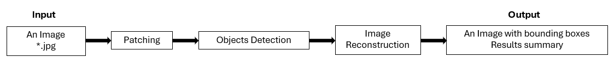

# NeonatesCounter
Counting neonates of black soldier flies in high resolution images.

### Summary:
"NeonatesCounter_v1.0.py" processes an input image by dividing it into smaller patches, detecting neonates in each patch, and then stitching the patches back together to reconstruct the full image, adding padding if necessary.  
The script outputs images with corresponding bounding boxes for each analyzed image (Figure 1). This script returns a dictionary with the structure {'image_name': number_of_detected_objects} and maps the number of detected objects to the "alg2_n_detections" column in the "CN_Result.xlsx" file located in the output folder.   

**Figure 1.** A schematic representation of the algorithm.    

### Integration with the MATLAB-based pipeline *Calibration_Vimba_V3*:
The script "NeonatesCounter_v1.0.py" is integrated into "Calibration_Vimba_V3.m", so when the GUI is run by pressing "Start", both analyses are executed.  
The Python script is called by the MATLAB script as follows:  
<pre> 
    % "Calibration_Vimba_V3.m" script, line 531.
    
    PathForExcel_python = strrep(PathForExcel, '\', '\\');
    model_path = "PATH_TO_MODEL\\NeonatesCounter_v1.0_model.pt"; % Insert the model path
    images_path = py.str(PathForExcel_python) ;
    pythonCommand = sprintf('python -c "import NeonatesCounter_v1_0; NeonatesCounter_v1_0.ImageProcessor(''%s'', ''%s'').process_images()"', model_path, PathForExcel_python);    
</pre>

The results of both image processing algorithms are summarized in "CN_Result.xlsx". Both algorirthm also output processed images, the first algorithm (i.e. Calibration_Vimba_V3.m) outputs the "Overlay.jpg" and the second algorithm i.e. "NeonatesCounter_v1.0.py" outputs *.jpg images with the suffix "_bboxes".    

  

  <strong>Version 1.0, 3/2025, All rights reserved to <a href="https://www.freezem.com/">FreezeM</a></strong>

  Development and maintenance by Saar Ezagouri

